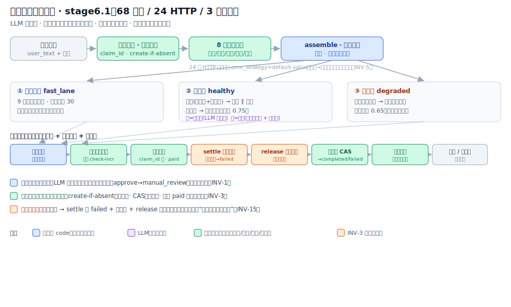

# 电商理赔自动处理系统 MVP

基于 Dify 1.13.3 的电商理赔自动处理个人作品。系统以 Dify Workflow 为编排核心，将订单、物流、用户画像、视觉识别、配置中心、状态机、快速通道计数、支付幂等、决策日志和知识库闭环拆分到明确边界中，验证从理赔申请到自动决策、人工兜底、日志沉淀和错误模式挖掘的完整链路。 

> 线上展示页：[metratio.com/index/claims](https://metratio.com/index/claims)

## 它解决什么 · 为什么难 · 怎么做

**问题**：电商理赔人工处理慢且不一致——既要给低风险小额单快速赔付，又要拦住高风险/大额/材料不全的单，还要在外部依赖抖动、支付失败时不丢单、不错赔、不重复扣款。

**为什么难**：直接让单个 LLM “看材料给结论”，会在事务一致性、幂等、原子计数、支付、审计上全面失守——LLM 不可复现、不具原子性，不能拥有不可逆副作用。

**方案**：把决策与副作用拆到明确边界——**LLM 只提议，确定性代码与外部服务处置**；按风险分**三带**（快速 / 健康 / 劣化）分配控制力；每个不可逆副作用**各自幂等**；支付失败做**跨服务补偿**。



> 完整设计文档（场景 / 设计原则 / 分支策略 / 合议 / 补偿 / 可观测性，21 节）：[docs/design.md](docs/design.md)
> 术语对照：`settle` = 结算节点 · `release` = 名额释放 · `biz_stats` = 业务态势 · 三带 = 快速通道 / 健康带 / 劣化带

## 快速开始

```
# 1. 启动 Mock 服务

docker compose -f docker-compose.mock.yml up -d --build

# 2. 健康检查

curl http://localhost:8080/health

# 3. 在 Dify 中导入主工作流

#    文件: dify-workflows/claims-main-workflow-stage6.1-inv3.yml

# 4. 导入知识库种子数据

#    指南: knowledge-base/IMPORT_GUIDE.md

# 5. 运行全链路测试

DIFY_MAIN_WORKFLOW_API_KEY='...' \

python3 tools/run_checks.py --mock-base http://localhost:8080 --workflow

# 6. 重置 Mock 状态

curl -X POST http://localhost:8080/mock/reset-all
```

## 目录结构

```

claims-automation/

├── README.md

├── docker-compose.mock.yml          # Mock 服务编排

├── mock/

│   ├── main.py                      # 统一 Mock 服务（30 路由端点：16 GET + 14 POST）

│   ├── Dockerfile

│   └── requirements.txt

├── dify-workflows/

│   ├── claims-main-workflow-stage6.1-inv3.yml  # ★ 当前主工作流（68节点，24 HTTP，INV-3补偿）


│   ├── copy-quality-assessment-1.13.3.yml  # 文案质量评估工作流

│   └── error-pattern-mining-1.13.3.yml     # 错误模式自动挖掘工作流

├── knowledge-base/

│   ├── IMPORT_GUIDE.md                     # 知识库导入指南

│   ├── error-patterns-official/            # 正式错误模式库（5 条）

│   ├── error-patterns-candidate/           # 候选错误模式库（1 条）

│   └── similar-cases/                      # 相似案例库（3 条）

├── sql/

│   └── init_decision_log.sql               # 决策日志表结构

├── test-data/

│   └── scenario-suite.json               # 8 个全链路测试场景

├── tools/

│   ├── run_checks.py                # 全链路自动化测试

│   ├── run_phase4_checks.py                # 闭环链路测试

│   └── write_candidate_pattern_to_kb.py    # 候选模式写入工具

└── docs/

    ├── architecture.svg                    # 主工作流架构图（README 顶部引用）

    ├── design.md                           # 完整设计文档（21 节）

    ├── stage5-test-report.md

    ├── phase4-closed-loop-test-report.md

    └── current-progress-and-next-steps.md
```

## 1. 项目状态

当前状态：核心链路已完成并通过测试。

| 阶段 | 状态 | 说明 |

|---|---|---|

| 阶段一 环境搭建 | 完成 | WSL2、Docker、Dify、Mock 网络链路可用 |

| 阶段二 Mock 与独立工作流 | 完成 | 外部依赖 Mock、文案质量评估、错误模式挖掘已发布 |

| 阶段三 Dify 主工作流 | 完成 | stage6.1 主工作流（含 INV-3 跨服务补偿）已发布并通过全链路测试与补偿验证 |

| 阶段四 闭环打通 | 完成 | 文案质量、错误挖掘、候选知识库写入已验证 |

| 阶段五 全链路测试 | 完成 | 8 个测试场景全部通过 |

| 阶段六 展示与沉淀 | 完成 | 展示页与本文档已落地 |

## 2. 技术栈

- Dify 1.13.3
    
- Dify Workflow
    
- Dify Knowledge Base
    
- Python Code 节点
    
- HTTP Request 节点
    
- DeepSeek LLM 插件
    
- FastAPI Mock 服务
    
- Docker Compose
    
- Redis / PostgreSQL Mock 边界
    
- Nginx 静态展示页
    

## 3. 系统边界

Dify 负责：

- 工作流编排
    
- 条件分支
    
- 并行 HTTP 调用
    
- 知识库检索
    
- 双 LLM 助手推理
    
- 合议中心规则融合
    
- 文案生成与校验
    
- 调用外部状态服务
    

外部 Mock 服务负责：

- 订单数据
    
- 物流异常
    
- 用户画像
    
- 图像分类
    
- 动态配置 `biz_stats`
    
- 理赔状态机
    
- 快速通道原子计数
    
- 支付幂等
    
- 决策日志
    

这样的边界是有意设计的：Dify 不承担事务一致性、原子计数和支付幂等，这些能力由外部服务提供。

## 4. 主工作流

当前主工作流文件：

```

dify-workflows/claims-main-workflow-stage6.1-inv3.yml
```

主工作流 API Key 由 Dify 控制台发布后生成，不写入代码仓库。

主工作流共 68 个节点（其中 24 个 HTTP 节点，含 settle+release 补偿链路），按数据质量分快速通道 / 健康 / 劣化三条结构对称的尾链。

主链路：

1. Start
    
2. 提取订单号与用户 ID
    
3. 生成 claim_id
    
4. 状态机幂等创建 `processing`
    
5. 8 路 HTTP 并行拉取数据
    
6. 数据预处理与快速通道判定
    
7. 知识库检索
    
8. 定责定损助手与用户信用助手并行推理
    
9. 合议中心
    
10. 文案生成与校验
    
11. 安全护栏
    
12. 快速通道原子计数
    
13. 支付幂等
    
14. settle 结算与补偿判定（支付失败 → 状态置 failed + 转人工）
    
15. release 释放快速通道名额（补偿路径：支付失败时归还已占用名额）
    
16. 状态机 CAS 完成
    
17. 决策日志写入
    

关键修复：

- 修复 `用户ID: U001` 被提取为 `D` 的正则问题。
    
- 24 个 HTTP 节点补齐 `error_strategy: default-value`，确保 503 等外部依赖失败进入降级路径。
    

## 5. 知识库

当前知识库：

| 知识库 | ID | 用途 |

|---|---|---|

| 错误模式库（正式） | `11c2953a-8fe5-40b8-bd08-698034e07305` | 主工作流检索正式错误模式 |

| 错误模式库（候选） | `84595bdf-aa20-4cd8-9a56-0fead9284e1a` | 文案质量和自动挖掘产生的候选模式；**不被主工作流检索**，与正式库物理隔离，人工确认后才迁入正式库 |

| 相似案例库 | `9114aeda-736d-4b14-a3ec-9d1b194c2352` | 主工作流检索相似历史案例 |

候选库已写入：

```
ERR-CANDIDATE-PHASE4-001.md
```

metadata：

| 字段 | 值 |

|---|---|

| priority | 15 |

| severity | medium |

| category | 自动挖掘 |

| status | pending_review |

| occurrence_count | 2 |

## 6. 独立闭环工作流

文案质量评估：

```
dify-workflows/copy-quality-assessment-1.13.3.yml
```

错误模式自动挖掘：

```
dify-workflows/error-pattern-mining-1.13.3.yml
```

闭环逻辑：

1. 主工作流写入决策日志。
    
2. 文案质量工作流旁路评估用户文案。
    
3. 低质量文案输出候选错误模式。
    
4. 错误模式挖掘工作流读取决策日志。
    
5. 按 `min_occurrence=2` 过滤单次噪声。
    
6. LLM 归纳候选错误模式。
    
7. 候选模式写入错误模式候选知识库。
    
8. 人工确认后可迁移到正式错误模式库。
    

## 7. 测试

全链路测试脚本：

```

cd ~/claims-automation

DIFY_MAIN_WORKFLOW_API_KEY='...' \

python3 tools/run_checks.py --mock-base http://localhost:8080 --workflow
```

阶段四闭环测试脚本：

```

cd ~/claims-automation

DIFY_COPY_QUALITY_API_KEY='...' \

DIFY_ERROR_MINING_API_KEY='...' \

python3 tools/run_phase4_checks.py --mock-base http://localhost:8080
```

候选模式写入脚本：

```

cd ~/claims-automation

DIFY_DATASET_API_KEY='...' \

python3 tools/write_candidate_pattern_to_kb.py \

  --name ERR-CANDIDATE-PHASE4-001.md \

  --pattern-json '[{"title":"manual_review filename_guess","category":"auto","priority":15,"status":"pending_review","occurrence_count":2,"description":"desc","mitigation":"mit","sample_claim_ids":["mine-001","mine-002"]}]'
```

跨服务补偿验证脚本（INV-3 · 故障注入）：

```

cd ~/claims-automation

python3 tools/check_inv3_compensation.py \

  --mock-base http://localhost:8080 \

  --main-key '...'
```

静态不变量检查（离线，无需起服务）：

```

cd ~/claims-automation

python3 tools/check_static_invariants.py
```

## 8. 全链路测试结果

| 场景 | 结果 | 决策 | 分支 | 状态机 | 支付 | 决策日志 |

|---|---|---|---|---|---|---|

| S01 快速通道 | 通过 | approve | fast_lane | completed | success | inserted |

| S02 中金额 | 通过 | manual_review | healthy | completed | skipped | inserted |

| S03 高风险用户 | 通过 | manual_review | healthy | completed | skipped | inserted |

| S04 大金额 | 通过 | manual_review | healthy | completed | skipped | inserted |

| S05 证据不足 / 物流签收争议 | 通过 | manual_review | healthy | completed | skipped | inserted |

| S06 外部依赖失败 | 通过 | manual_review | healthy | completed | skipped | inserted |

| S07 重复提交 | 通过 | approve / duplicate | early end | completed | success once | inserted once |

| S08 劣化模式 | 通过 | manual_review | degraded | completed | skipped | inserted |

S06 的 Dify 状态为 `partial-succeeded`，这是预期行为。HTTP 节点真实发生 503，但由 `default-value` 接住，业务结果完整落地。

测试脚本（`tools/run_checks.py`）对每个场景自动断言：分支（fast_lane/healthy/degraded）、决策（approve/manual_review/reject）、支付副作用（approve→success，否则 skipped）、run 状态（S06 为 partial-succeeded）、重复提交（S07 第二次返回 duplicate 且不产生重复支付/日志）、以及决策日志写入。期望值编码于脚本的 `EXPECTATIONS`，断言逻辑由 `tools/test_expectations.py`（离线单测）固化。仅 transient 失败（连接/超时/5xx/run failed）触发有界重试（`--max-attempts`），分支或决策不符直接判失败。上表为 workflow-mode 实跑结果，8 个场景全部通过自动断言，且各场景 claim_id 互不相同（S01/S07/S08 使用不同订单与用户，避免幂等键碰撞）。

## 9. 阶段四闭环测试结果

文案质量评估：

- 好文案：`quality_status=passed`
    
- 坏文案：`quality_status=candidate_generated`
    
- 识别问题：`too_short`, `risky_absolute_terms`, `approve_without_amount`
    

错误模式自动挖掘：

- 输入日志：3 条
    
- 噪声过滤：7 天内至少 2 次
    
- 输出候选：1 条
    
- 样本：`mine-001`, `mine-002`
    

候选知识库写入：

- 文档 ID：`3a42925d-e59d-4070-a0fd-80432b7cba6d`
    
- 索引状态：`completed`
    
- 显示状态：`available`
    

## 10. 目录说明

```

claims-automation/

  dify-workflows/

    claims-main-workflow-stage6.1-inv3.yml

    copy-quality-assessment-1.13.3.yml

    error-pattern-mining-1.13.3.yml

  docs/

    architecture.svg

    design.md

    stage5-test-report.md

    phase4-closed-loop-test-report.md

    current-progress-and-next-steps.md

  knowledge-base/

    IMPORT_GUIDE.md

    error-patterns-official/

    error-patterns-candidate/

    similar-cases/

  mock/

    main.py

    Dockerfile

    requirements.txt

  test-data/

    scenario-suite.json

  tools/

    run_checks.py

    run_phase4_checks.py

    write_candidate_pattern_to_kb.py

  README.md
```

## 11. 运行与维护

启动 Mock：

```

cd ~/claims-automation

docker compose -f docker-compose.mock.yml up -d --build claims-mock
```

健康检查：

```

curl http://localhost:8080/health
```

重置 Mock 状态：

```

curl -X POST http://localhost:8080/mock/reset-all
```

查看决策日志：

```

curl 'http://localhost:8080/mock/decision-log/query?days=7'
```

## 12. 已知边界

- 当前系统是个人作品和 MVP，支付、状态机、图像识别均为 Mock。
    
- 主工作流使用 Dify DAG，不依赖循环节点；文案失败采用转人工兜底。
    
- 外部依赖失败返回 `partial-succeeded` 属于可接受信号，业务层已完成降级。
    
- 候选错误模式需要人工确认后再进入正式错误模式库。
    
- 材料真实性当前为简化实现：图像分类节点按固定入参调用，Mock 默认返回材料齐全，材料完整性尚未实际强制；材料相关用例的转人工主要由物流信号与 LLM 证据判断驱动。
    
- 状态机 `ttl` 参数当前仅记录、未实际触发过期；快速通道计数读取失败默认按 0 处理，最终原子保护在 `try-increment`。
    
- 自动化测试已对分支、决策、支付副作用、run 状态与重复拦截做脚本断言（`run_checks.py` 的 `EXPECTATIONS` + `test_expectations.py`），workflow-mode 实跑 8/8 通过；仅 transient 失败有界重试。
    
- 跨服务补偿（INV-3）：v2 在支付失败后仍把状态机置 completed 且不释放快速通道名额（已用 `tools/check_inv3_compensation.py` 实跑复现）。修复版 `dify-workflows/claims-main-workflow-stage6.1-inv3.yml` 在 payment 后加入 settle+release 节点（支付失败→状态 failed + 转人工 + 释放名额），已通过 tools/check_inv3_compensation.py live-verified。
    
- 业务可观测性（设计 §19）尚未实现：现有 Prometheus/Grafana 为系统级（CPU/容器/blackbox），自动通过率、人工兜底率、降级率、支付失败数、P95 延迟等业务指标暂未落地，劣化时"自动收缩审批范围"也未接入。
    
- 决策日志写入字段为设计 §15 的子集：当前约落库 16 个字段（含支付结果、最终状态、补偿标志、订单金额、定责定损原始输出、用户信用原始输出），但业务态势快照、置信度、证据包等字段仍为设计与拟扩展预留。这也限制了上述业务指标的可计算性与错误挖掘的丰富度。
    
- 真正生产化需要替换 Mock 服务、增加鉴权、审计、风控审批和持久化事务。
    

## 13. 展示页

线上展示页：

```

https://metratio.com/index/claims
```

展示页覆盖：

- 系统概览
    
- 主工作流链路
    
- 闭环链路
    
- 全链路测试结果
    
- 候选知识库证据
    
- 六阶段进度